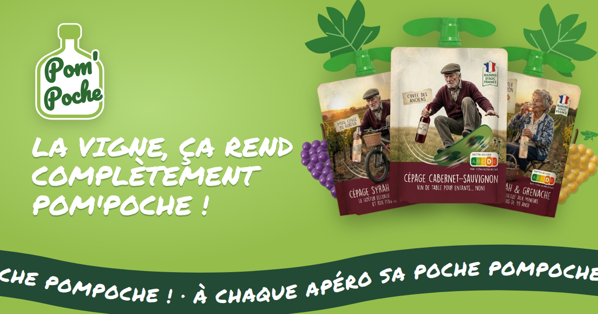
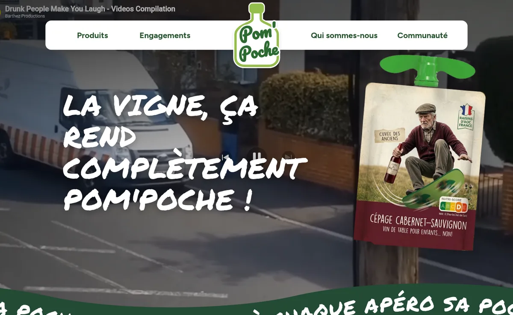
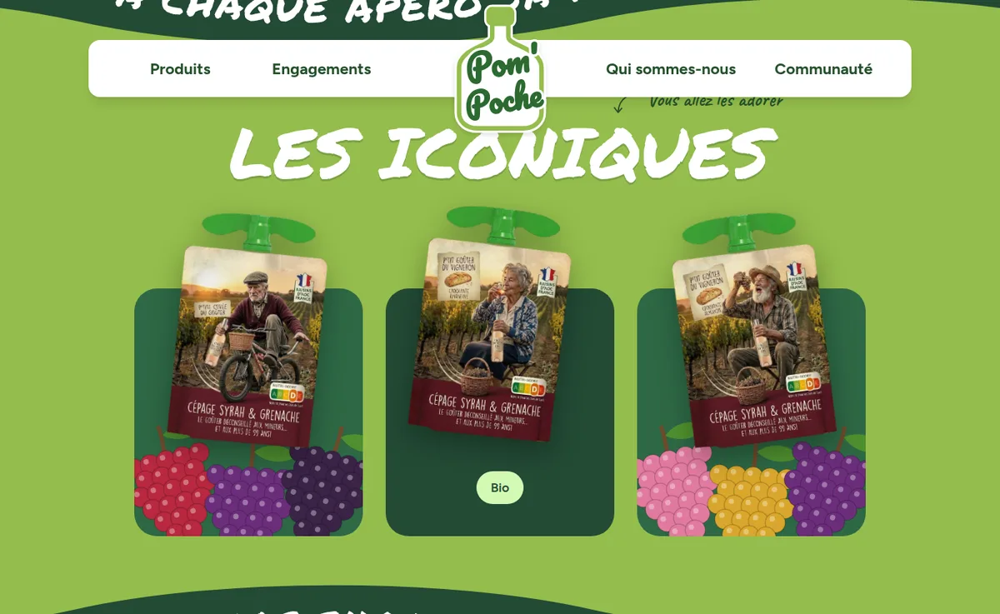
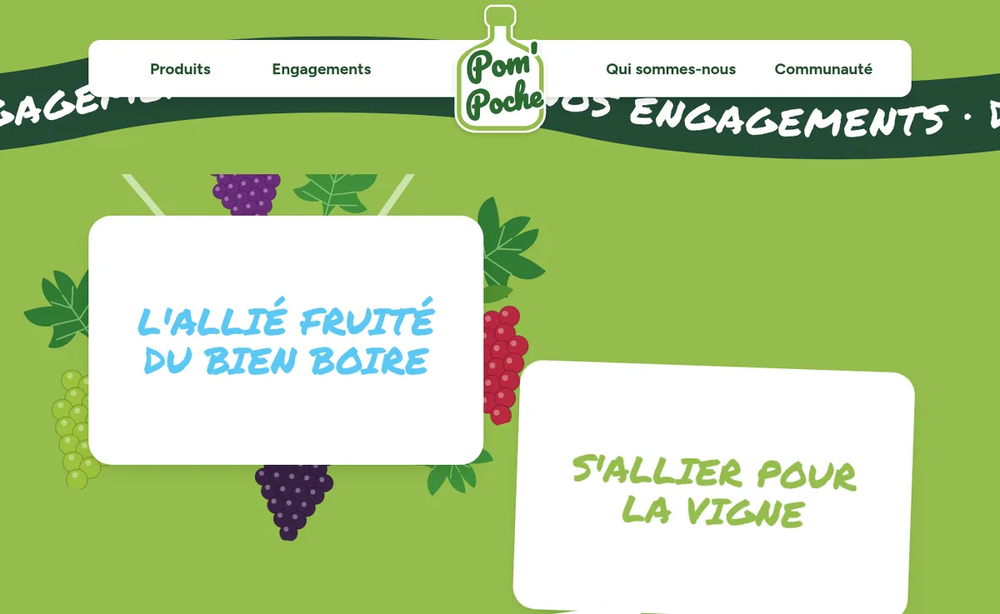
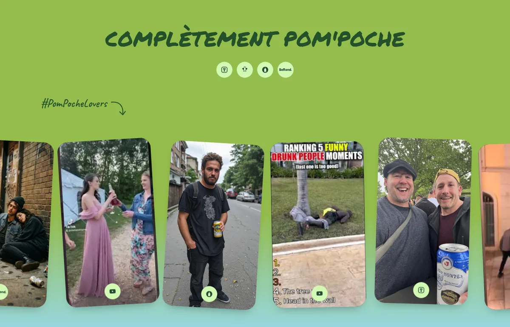

<div align="center">

[](https://pom-poche.vercel.app)

# PomPoche

**Le vin en gourde des grands enfants. Syrah, Grenache et Cabernet en poche à
boire : à chaque apéro sa poche PomPoche.**

[](./LICENSE)


### [▶ Voir le site](https://pom-poche.vercel.app)

</div>

---

## Le pitch

Les gourdes de compote ont rendu le goûter nomade, ludique et sans cuillère.
**PomPoche fait la même chose avec le vin.**

Même gourde, même bouchon à ailettes, même vert pomme, même ton enjoué de
marque familiale. Sauf que dedans, c'est du Syrah & Grenache, que la mascotte a
quatre-vingts ans et un skate, et que le Nutri-Score affiche fièrement un **D,
pour les Durs de Cuir**.

PomPoche est une page vitrine **entièrement parodique** : une seule page, un
long scroll, et tous les codes d'un vrai site de marque, pris au pied de la
lettre.

> Le goûter déconseillé aux mineurs… et aux plus de 99 ans !

<div align="center">
  
</div>

## Au menu

- 🍇 **Les iconiques** : trois gourdes, trois papys et mamies du vignoble. Au
  survol, la poche pivote, les grappes s'écartent et une bulle annonce la
  couleur : *Sans sucres ajoutés*, *Bio*, *5 cépages*.
- 🌿 **Nos engagements** : « L'allié fruité du bien boire », « S'allier pour la
  vigne », « L'allié de tous les apéros ». Survolez une carte : une gerbe de
  grappes et de feuilles de vigne jaillit derrière.
- 🎞️ **Pionniers depuis 2026** : une marque fondée cette année, donc une frise
  historique d'une seule date, et trois polaroïds vidéo pour le patrimoine.
- 📱 **La communauté** : un défilé de photos et de Shorts, sur des réseaux
  sociaux qui n'existent pas (Picolagram, TikTrinque, FaceBouteille, BeRond.).
- 〰️ **Des bandeaux en vague** dont le texte suit la courbe et avance avec le
  scroll, comme sur le vrai site.
- 🍾 **Un logo en bouteille**, jusque dans le favicon.

<div align="center">
  
</div>

<table>
  <tr>
    <td></td>
    <td></td>
  </tr>
</table>

## Comment c'est fait

Une seule page Vue, 100 % statique, sans backend. Quelques détails qui
n'allaient pas de soi :

- **Les Shorts démarrent sans délai.** Un lecteur YouTube met environ une
  seconde à se lancer, c'est long pour un survol. Chaque vignette précharge donc
  son lecteur dès qu'elle approche de l'écran et le fait tourner, muet et
  invisible, sous la miniature : le survol ne fait que le révéler (~10 ms).
- **Les vidéos tournent à chaque visite.** Les Shorts sont piochés au hasard
  dans un réservoir, et si l'un d'eux a disparu de YouTube, la vignette passe
  toute seule à une vidéo de secours, avant même qu'on la survole.
- **Le bandeau en vague n'est qu'un seul tracé SVG.** Épais, il dessine la
  vague ; en `textPath`, il porte le texte, qui avance au rythme du scroll et
  s'arrête avec lui.
- **Les gourdes sont détourées par un script.** Les maquettes partagent le même
  gabarit : le corps suit un contour fixe, le bouchon est isolé par son vert
  saturé. `make pouches` régénère tout, au pixel près.
- **L'image de partage n'est pas une maquette.** Elle est rendue à partir des
  vrais composants du site (logo, bandeau, grappes, gourdes détourées) par
  `make og`.

## Démarrage

Prérequis : Node.js 22 ou 24 et `make`.

```sh
make install   # installe les dépendances
make start     # serveur de développement (http://localhost:9096)
make check     # build + lint + typecheck + knip + tests
make og        # régénère l'image de partage (nécessite Chrome)
make pouches   # redétoure les gourdes (nécessite Python + Pillow et ImageMagick)
```

`make help` liste toutes les commandes. Le build (`dist/`) est **100 %
statique** et se déploie tel quel sur Vercel ou n'importe quel hébergeur de
fichiers statiques.

Stack : Vue 3 · TypeScript strict · Vite · Tailwind CSS v4 · Vitest + Testing
Library. Les conventions et l'architecture sont détaillées dans
[AGENTS.md](./AGENTS.md).

## Ajouter du contenu

| Pour ajouter… | Où |
|---|---|
| un Short YouTube | son identifiant dans `SHORTS` (`src/data/community.ts`) |
| une photo de fan | le fichier dans `public/community/`, puis une entrée dans `PHOTOS` |
| une gourde | la maquette 671x1024 dans `pouches/src/`, puis `make pouches` |

Avant d'ajouter une vidéo, vérifiez que son auteur autorise l'intégration sur
d'autres sites : sinon YouTube affiche « Vidéo non disponible ».

## Avertissement

PomPoche est une **parodie**. Aucune gourde de vin n'est vendue, aucune marque
n'est associée à ce projet, et personne ne devrait mettre de vin dans le goûter
de qui que ce soit. Les vidéos restent la propriété de leurs auteurs et sont
intégrées depuis YouTube.

**L'abus d'alcool est dangereux pour la santé, à consommer avec modération.** La
mention figure aussi sur le site, sous les iconiques et dans le pied de page.

## Licence

Code sous licence [MIT](./LICENSE).

---

<div align="center">
  <sub>
    Fait avec ❤️ par
    <a href="https://yavadeus.dev"><b>YavaDeus</b></a>
  </sub>
</div>
